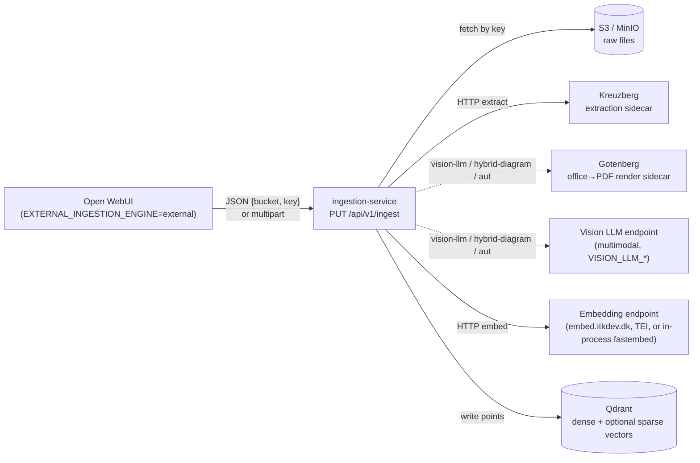
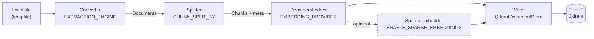

# Ingestion Service

Document ingestion microservice for [AarhusAI](https://github.com/AarhusAI).
A standalone FastAPI service that runs a [Haystack v2](https://haystack.deepset.ai/)
indexing pipeline (extract → chunk → embed → store) and writes Haystack-native documents
to Qdrant. The pluggable extraction engine, dense embedder, and optional sparse embedder
are all driven by configuration — the service isn't bound to any specific embedding model.

Called by Open WebUI when `EXTERNAL_INGESTION_ENGINE=external`. The Open WebUI patch
delegates to `PUT /api/v1/ingest` with either an S3 reference (preferred) or a multipart
file upload.

## How Ingestion Works

The service is a thin FastAPI shell around a Haystack v2 pipeline. FastAPI handles
transport, auth, and the temp-file lifecycle; the pipeline does the actual work
(extract → chunk → embed → write). The pipeline is built once at lifespan startup
and cached as module-level state — Haystack pipelines aren't cheap to construct and
the sparse embedder downloads its model on first warm-up.

### System Context

Where the service sits in the broader stack and what it talks to:



Open WebUI uploads the raw file to S3/MinIO first, then calls `PUT /api/v1/ingest`
with the bucket + key. The multipart fallback exists for direct uploads but the
S3 path is preferred — it keeps large files off the FastAPI worker's heap.

### Pipeline DAG

What happens to the file once the route handler hands it off to
`run_indexing_pipeline()`:



Each stage, in order:

- **Converter** (`app/pipelines/converters.py`) — turns the raw file into one or
  more Haystack `Document` objects. Factory dispatches on `EXTRACTION_ENGINE`:
  `kreuzberg` is an HTTP sidecar, `pypdf` is in-process,
  `docling` / `unstructured` require optional deps. Kreuzberg uses a custom
  Haystack component (`app/pipelines/kreuzberg_converter.py`) that additionally
  surfaces document-level metadata (title, authors, languages) and renders
  embedded tables as Markdown. `vision-llm` renders pages and reconstructs
  layout-bound documents (flowcharts, scans) via a multimodal LLM; `hybrid-diagram`
  pairs native docx text with a vision-inferred Mermaid graph. See
  [Extraction Engines](#extraction-engines).

- **Splitter** (`app/pipelines/splitter.py`) — slices documents into chunks.
  Three factory branches selected by `CHUNK_SPLIT_BY`: `HuggingFaceTokenizerSplitter`
  (token mode, default — measures chunk size in the embedding model's actual
  tokens), `MarkdownChunker` (markdown mode — splits on heading hierarchy first,
  then token-packs sections; attaches `meta.headers` breadcrumb), or Haystack's
  built-in `DocumentSplitter` (word / sentence / passage modes). All branches
  attach `meta.split_id` (sequential chunk index within the file).

- **Dense embedder** (`app/pipelines/embedders.py`) — turns each chunk's text
  into a fixed-size vector. Required. Three providers selected by
  `EMBEDDING_PROVIDER`: `openai-compat` (HTTP, the current `embed.itkdev.dk`
  path), `fastembed` (in-process), `tei` (HTTP, OpenAI-compatible wire format).
  Applies `EMBEDDING_PREFIX_DOC` to each chunk before embedding so e5/nomic
  models get the prefix they were trained on.

- **Sparse embedder** (optional, `app/pipelines/embedders.py`) — when
  `ENABLE_SPARSE_EMBEDDINGS=true`, adds a second named vector per chunk
  (BM42 / SPLADE family via fastembed). Lets the retrieval agent use Qdrant's
  native RRF hybrid query at search time instead of client-side BM25. Skipped
  entirely when disabled — the writer sees dense-only chunks.

- **Writer** — `DocumentWriter` backed by `QdrantDocumentStore`. Writes the
  dense vector (and the sparse vector when enabled) as named vectors on a single
  Qdrant point per chunk. Multitenancy HNSW is configured at the store layer
  (`hnsw_config={"m": 0, "payload_m": 16}`) and the per-tenant subgraph key is
  `meta.collection_name`; its keyword payload index is created by
  `app/services/qdrant_setup.py` at startup.

### Idempotency

Before the pipeline runs, `_delete_existing_by_file_id()` removes any existing
Qdrant points whose `meta.file_id` matches the incoming request (when
`overwrite=true`, which is the default). If the pipeline throws at any stage,
the same delete runs again as teardown. The contract for callers is:

- A `status: true` response means the file is fully indexed (all chunks
  written, all vectors present).
- Any other outcome means the file's chunks are absent from Qdrant — partial
  writes don't leak through.
- Retries with the same `file_id` are safe; no duplicate vectors.

Open WebUI's reindex action depends on this contract.

### Code Tour

Where to start reading when you need to change something:

| File | What lives there |
|---|---|
| `app/main.py` | FastAPI app, lifespan, health endpoints |
| `app/routes/ingest.py` | `PUT /api/v1/ingest` — auth, content-type dispatch, temp-file lifecycle, error code mapping |
| `app/routes/extract.py` | `POST /api/v1/extract` — developer-facing extraction probe |
| `app/pipelines/indexing.py` | Pipeline DAG construction, idempotency, exception teardown |
| `app/pipelines/converters.py` | Converter factory (`EXTRACTION_ENGINE` dispatch) |
| `app/pipelines/kreuzberg_converter.py` | Custom Haystack component for the Kreuzberg HTTP sidecar |
| `app/pipelines/routing_converter.py` | `auto` mode — per-document engine routing (docx signals live in `detectors.py`) |
| `app/pipelines/vision_llm_converter.py` | `vision-llm` engine — page render → multimodal LLM → Markdown + Mermaid |
| `app/pipelines/hybrid_diagram_converter.py` | `hybrid-diagram` engine — native docx text + vision-inferred diagram |
| `app/pipelines/vision_profiles.py` | Vision prompt profiles + the `KNOWN_PROFILES` registry |
| `app/pipelines/rendering.py` | Page rendering — office→PDF via Gotenberg, PDF→PNG local |
| `app/pipelines/splitter.py` | Splitter factory + custom HF tokenizer / Markdown chunkers |
| `app/pipelines/embedders.py` | Dense (required) + sparse (optional) embedder factories |
| `app/services/qdrant_setup.py` | Payload-index bootstrap (`collection_name`, `collection_type`, `languages`) |
| `app/services/s3.py` | S3 fetch for JSON-mode ingest requests |
| `app/config.py` | pydantic-settings env binding (single source of truth for config) |
| `app/models.py` | Request / response Pydantic schemas |

## Requirements

- Docker and Docker Compose
- [Task](https://taskfile.dev/) (Go Task runner)
- A Qdrant instance (shared with the retrieval agent)
- An OpenAI-compatible embedding endpoint (e.g. the `embed.itkdev.dk` proxy)
- An extraction sidecar reachable on the same network: a Kreuzberg API server
  (`EXTRACTION_ENGINE=kreuzberg` — the value shipped in `.env.example` and the
  code-level default in `config.py`, so it's what you get out of the box). It
  ships as a container in the parent stack. See
  [Extraction Engines](#extraction-engines) for the full matrix.
- **Only for the vision engines** (`vision-llm`, `hybrid-diagram`, or `auto`
  when it routes a diagram-heavy document): a [Gotenberg](https://gotenberg.dev/)
  sidecar for office→PDF rendering — bundled in this repo's own
  `docker-compose.yml`, so `task up` starts it for you — **and** an
  OpenAI-compatible multimodal LLM endpoint (configured via `VISION_LLM_*`).
  These are inert unless a vision engine is actually selected.

## Quick Start

### Local Development

```shell
cp .env.example .env
# Edit .env — at minimum set API_KEY and EMBEDDING_API_KEY. The other defaults
# in .env.example (EXTRACTION_ENGINE=kreuzberg,
# EMBEDDING_API_BASE_URL=https://embed.itkdev.dk/v1, MinIO, Qdrant, and the
# Kreuzberg sidecar URL) are the working Aarhus dev values; only override
# when pointing at something else. If you switch to a vision engine
# (vision-llm / hybrid-diagram / auto), also set VISION_LLM_API_BASE_URL +
# VISION_LLM_API_KEY.

# Generate a secure API key:
python -c "import secrets; print(secrets.token_urlsafe(32))"

# Where the same secret has to land:
#   - standalone:    set as API_KEY in this service's .env.
#   - parent stack:  set as INGESTION_API_KEY in the parent .env. The parent
#                    docker-compose forks it into two places — this service's
#                    API_KEY and the openwebui container's
#                    EXTERNAL_INGESTION_API_KEY. You do not set the latter two
#                    by hand.

task setup          # starts container + installs dev deps (requires Traefik 'frontend' network)
task logs           # tail ingestion container logs
```

Common task commands:

```shell
task up             # start containers (creates/verifies the 'frontend' network first)
task down           # stop containers
task restart        # down + up
task build          # build the container image
task shell          # open bash shell in the ingestion container
task install        # reinstall deps (pip install '.[dev]')
task lint           # run all linters (ruff check + format --check)
task lint:fix       # auto-fix lint issues
task test           # run all tests (pytest -v)
task test:coverage  # run tests with coverage report
task audit          # security audit: pip-audit (CVEs) + bandit (static scan); advisory only
task audit:deps     # scan installed deps for known CVEs (pip-audit --strict)
task audit:code     # static security scan of app/ (bandit -ll)
task ci             # lint + test
```

Run a single test (or one test in a file):

```shell
docker compose exec ingestion pytest tests/test_ingest_endpoint.py -v
docker compose exec ingestion pytest tests/test_ingest_endpoint.py::test_json_mode_happy_path -v
```

### Production Image

```shell
task build:image                              # build + push multi-arch (linux/amd64 + linux/arm64) to ghcr.io/aarhusai/ingestion-service:latest
task build:image TAG=v1.0.0                   # with specific tag
task build:image PLATFORMS=linux/amd64        # single-arch (skips QEMU emulation; much faster for local iteration)
```

First run will create a buildx builder (`ingestion-service-builder`) and register QEMU binfmt handlers for cross-arch emulation — idempotent, no-op on subsequent runs.

## Health Endpoints

- `GET /health` — liveness probe (always 200 if the process is running)
- `GET /health/ready` — readiness probe. Returns 503 until the Haystack pipeline has finished warming up (the sparse embedder pulls its model from HuggingFace on first boot — ~80 MB) **and** Qdrant is reachable. This keeps Docker / Kubernetes from routing traffic during cold start.

## API

### `PUT /api/v1/ingest`

Two transport modes share one endpoint and dispatch on `Content-Type`.

#### S3-reference mode (preferred)

```http
PUT /api/v1/ingest HTTP/1.1
Authorization: Bearer <API_KEY>
Content-Type: application/json

{
  "s3_bucket": "openwebui",
  "s3_key": "files/abc/report.pdf",
  "file_id": "abc",
  "filename": "report.pdf",
  "collection_name": "file-abc",
  "collection_type": "file",
  "user_id": "u-1",
  "overwrite": true
}
```

#### Multipart fallback

```http
PUT /api/v1/ingest HTTP/1.1
Authorization: Bearer <API_KEY>
Content-Type: multipart/form-data; boundary=...

# fields:
file=<binary>
file_id=abc
filename=report.pdf
collection_name=file-abc
collection_type=file
user_id=u-1
overwrite=true
```

#### Response

```json
{
  "status": true,
  "collection_name": "file-abc",
  "chunks_count": 42
}
```

With `EXTRACTION_ENGINE=auto`, the response also carries an `extraction` object
recording which engine handled the document and why:

```json
{
  "status": true,
  "collection_name": "file-abc",
  "chunks_count": 42,
  "extraction": {
    "engine": "hybrid-diagram",
    "route": {"signal": "textbox", "textboxes": 50, "body_words": 5, "ratio": 8.33}
  }
}
```

`route` is `null` (and the whole `extraction` object omitted) for a pinned
engine, where no classification step runs.

#### Error

```json
{
  "status": false,
  "error": "human-readable message",
  "code": "EXTRACTION_FAILED"
}
```

Codes: `EXTRACTION_FAILED`, `EMBEDDING_FAILED`, `SPARSE_EMBEDDING_FAILED`,
`QDRANT_WRITE_FAILED`, `S3_FETCH_FAILED`, `INVALID_REQUEST`, `PIPELINE_FAILED`.

#### Idempotency

When `overwrite=true` (default), all existing Qdrant points with matching
`meta.file_id` are deleted before writing new chunks. Retries are safe — they
delete-and-rewrite, no duplicates. On any pipeline failure the same delete runs
as teardown, so partial writes never leak into Qdrant.

### `POST /api/v1/extract`

Developer-facing extraction probe: runs the configured Haystack converter
against an uploaded file and returns the raw extracted documents. No chunking,
no embedding, no Qdrant writes. Useful for sanity-checking how a given engine
sees a document before committing to a full ingest, and for comparing engines
side-by-side without restarting the container.

Multipart-only. Same Bearer-token auth as `/api/v1/ingest`.

Fields:

- `file` (required) — the document to extract.
- `engine` (optional) — one of
  `pypdf | docling | unstructured | kreuzberg | vision-llm | hybrid-diagram`.
  Overrides `EXTRACTION_ENGINE` for this single request. When omitted, the
  configured default is used. `auto` is a routing *mode* for ingest, not a
  concrete converter, so it is **not** accepted here — pick the engine you want
  to probe directly.
- `profile` (optional) — vision-llm prompt profile. One of
  `diagram | diagram-topology | general | figure | ocr` (the full profile
  registry; `diagram-topology` and `figure` are primarily the auto / hybrid
  internal profiles, but the endpoint accepts them too for probing). Accepted
  only by the profile-aware engines — `vision-llm` and `hybrid-diagram` (where
  it pins the vision fallback profile); supplying it for any other engine is a
  `400 INVALID_REQUEST`. When omitted, the engine's configured default applies
  (`VISION_LLM_PROFILE` for `vision-llm`; `hybrid-diagram` auto-selects per
  document).

#### Example

```shell
curl -X POST \
  -H "Authorization: Bearer $API_KEY" \
  -F file=@sample.pdf \
  -F engine=pypdf \
  http://localhost:8000/api/v1/extract
```

#### Response

```json
{
  "status": true,
  "engine": "pypdf",
  "profile": null,
  "documents": [
    {"content": "# Heading\n...", "meta": {"page": 1}},
    {"content": "...",            "meta": {"page": 2}}
  ]
}
```

`profile` echoes the vision-llm prompt profile actually used (e.g. `"diagram"`),
and is `null` for the non-vision engines.

Errors use the same `IngestError` shape as `/api/v1/ingest`. Codes returned:
`INVALID_REQUEST` (unknown engine, missing file, missing optional dependency
for `docling`/`unstructured`) and `EXTRACTION_FAILED` (converter raised at
runtime). Note that `engine=unstructured` is wired in but its converter uses
a `paths=` input socket Haystack's pipeline doesn't currently route to — the
ingest pipeline has the same limitation; this endpoint will surface it as
`EXTRACTION_FAILED`.

### `GET /api/v1/documents/{file_id}/chunks`

Read-only chunk inspection — answers "what did this document get split into,
and which extraction/classification path did it hit?" by reading the stored
points back from Qdrant (`meta.file_id` filter). Off by default; enable with
`ENABLE_INSPECTION_API=true`. Same Bearer-token auth as `/api/v1/ingest`; when
disabled it returns `404`.

Query params: `limit` (1–1000, default 50), `offset` (the `next_offset` cursor
from a previous response), `include_content` (`false | preview | full`, default
`preview` — first 200 chars).

```shell
curl -H "Authorization: Bearer $API_KEY" \
  "http://localhost:8000/api/v1/documents/abc/chunks?include_content=preview"
```

```json
{
  "status": true,
  "file_id": "abc",
  "returned": 42,
  "limit": 50,
  "stats": {
    "total_chunks": 42,
    "extraction_engine": "hybrid-diagram",
    "extraction_route": {"signal": "textbox", "ratio": 8.33},
    "languages": ["da"],
    "name": "flow.docx",
    "collection_name": "file-abc"
  },
  "chunks": [
    {"split_id": 0, "content_length": 380, "content": "…", "meta": {"headers": ["Intro"], "page": 1}}
  ]
}
```

## Observability

Four independently-toggleable layers of insight into how documents are ingested:

- **Log verbosity** — `LOG_LEVEL` (`DEBUG | INFO | WARNING | ERROR | CRITICAL`)
  is the primary dial, applied to the root logger. The per-document routing
  decision logs at **INFO** (`routing X.docx -> engine=… signal=… profile=…`);
  the detailed detector metrics (textbox counts, ratios, image area) log at
  **DEBUG**. `LOG_LEVEL_APP` optionally overrides just the `app` namespace, so
  you can run verbose app logs without the third-party DEBUG flood (httpx /
  boto3 / haystack); empty inherits `LOG_LEVEL`. (`DEBUG=true` is unrelated to
  verbosity — it only reflects `str(exc)` in error responses for triage.)
- **Structured logs** — `LOG_FORMAT=json` emits one JSON object per line
  (`ts`, `level`, `logger`, `msg`, plus any structured `extra=` fields) for
  Loki / a JSON-aware log pipeline. `text` (default) keeps the human format.
- **Classification visibility** — which engine each document hit, and why, is
  surfaced three ways: the INFO log line, the ingest response's `extraction`
  object, and persisted onto every chunk's `meta` (`extraction_engine`,
  `extraction_route`) so it's queryable after the fact via the inspection
  endpoint.
- **Prometheus metrics** — `GET /metrics` (set `METRICS_ENABLED=true`, the
  default; `false` → 404). Bearer-authenticated with the same `API_KEY` as
  `/api/v1/ingest` (mirrors retrieval-agent) — the scrape job must send
  `Authorization: Bearer <API_KEY>`. Exposes:
  `ingest_requests_total{outcome,code}`, `ingest_duration_seconds`,
  `ingest_chunks`, `ingest_document_bytes`,
  `extraction_route_total{engine,signal}`, and
  `pipeline_stage_duration_seconds{stage}` (per component — the `dense_embedder`
  stage is the bottleneck under load).
- **Chunk inspection** — `GET /api/v1/documents/{file_id}/chunks` (above),
  gated by `ENABLE_INSPECTION_API`.

## Configuration

All config is via environment variables loaded by pydantic-settings. See
`.env.example` for the full list. The settings that matter beyond their docstrings
because they are **contracts with other services**:

- `API_KEY` must equal Open WebUI's `EXTERNAL_INGESTION_API_KEY` (and the
  retrieval agent's parallel value when querying the same data).
- `EMBEDDING_MODEL`, `EMBEDDING_DIM`, and `EMBEDDING_PREFIX_DOC` must match
  whatever the retrieval agent uses at query time. e5 needs `passage: ` on
  documents and `query: ` on queries; bge-m3 takes no prefix; nomic uses
  `search_document: ` / `search_query: `.
- `QDRANT_INDEX` is the physical Qdrant collection. Defaults to
  `ingestion_files` — distinct from Open WebUI's legacy multitenancy collections.
- `ENABLE_SPARSE_EMBEDDINGS=true` adds a sparse vector to each Qdrant point so
  the retrieval agent can use Qdrant's native hybrid query (RRF fusion) instead
  of the legacy client-side BM25.
- `EMBEDDING_THREADS` caps the ONNX thread pool of the in-process fastembed
  embedders (the sparse BM42 model, and the dense embedder when
  `EMBEDDING_PROVIDER=fastembed`). ONNX otherwise grabs every core, saturating
  CPU mid-ingest so the uvicorn event loop can't answer `/health` and Docker
  restarts the container. `0` (default) = auto: leave 2 cores free for the event
  loop; a positive value pins the count. Auto can't see a `cpus:` CFS quota, so
  set it explicitly if you CPU-limit the container. `OMP_NUM_THREADS` (default
  `4`) backstops onnxruntime's OpenMP/BLAS kernels and must be an env var (it is
  read at native-library load time, before any Python runs).
- `CHUNK_SPLIT_BY` selects the chunking strategy. The default `token` mode
  measures `CHUNK_SIZE` / `CHUNK_OVERLAP` in the embedding model's actual
  HuggingFace tokens (via `RecursiveCharacterTextSplitter.from_huggingface_tokenizer`)
  so chunks respect the model's context window — important for e5-large's
  512-token cap once the `passage: ` prefix is prepended. `markdown` mode is
  structure-aware: it splits on Markdown headings (`#`, `##`, `###`) first,
  then token-packs each section that exceeds `CHUNK_SIZE`, and writes the
  heading breadcrumb to `meta.headers` on each chunk — most useful when the
  converter emits Markdown (Docling natively, Kreuzberg with table rendering).
  `word`, `sentence`, and `passage` delegate to Haystack's built-in
  `DocumentSplitter` and count in those units instead. Token and markdown
  modes use `TOKENIZER_MODEL` if set, otherwise fall back to `EMBEDDING_MODEL`.

## Supported Embedding Models

| Model | Dim | Doc / query prefix | Native sparse |
|---|---|---|---|
| `intfloat/multilingual-e5-large` | 1024 | `passage: ` / `query: ` | — |
| `BAAI/bge-m3` | 1024 | none / none | yes |
| `jinaai/jina-embeddings-v3` | 1024 | task-specific | — |
| `nomic-ai/nomic-embed-text-v1.5` | 768 | `search_document: ` / `search_query: ` | — |

`EMBEDDING_PROVIDER`:
- `openai-compat` → `OpenAIDocumentEmbedder` (the current `embed.itkdev.dk` path)
- `fastembed` → `FastembedDocumentEmbedder` (in-process inference; supports BGE-M3 dense)
- `tei` → routes through `OpenAIDocumentEmbedder` (TEI exposes an OpenAI-compatible endpoint)

`SPARSE_EMBEDDING_PROVIDER`:
- `fastembed` → `FastembedSparseDocumentEmbedder` (BGE-M3 sparse, BM42, SPLADE family)
- `none` → no sparse stage, dense-only pipeline

## Extraction Engines

| `EXTRACTION_ENGINE` | Status | Notes |
|---|---|---|
| `kreuzberg` | day-one (default) | HTTP sidecar — `goldziher/kreuzberg` container in the parent stack (`KREUZBERG_URL`). 91+ formats, fully local; switch to `-easyocr` / `-paddle` image tags for OCR |
| `pypdf` | day-one | In-process, PDF-only, lightweight |
| `docling` | optional dep | Add `docling-haystack` to `pyproject.toml` and rebuild |
| `unstructured` | optional dep | Add `unstructured-fileconverter-haystack` to `pyproject.toml` and rebuild |
| `vision-llm` | day-one | Renders pages (Gotenberg sidecar for office→PDF, local PDF→PNG) and reconstructs structure via a multimodal LLM (`VISION_LLM_*`). For flowcharts / diagrams / scanned forms whose meaning is in the layout |
| `hybrid-diagram` | day-one | For diagram `.docx`: native text from the package XML (authoritative, verbatim labels) + a vision-inferred diagram. Picks its vision profile per document — `diagram-topology` (Mermaid only) for a *vector* flowchart whose labels are Word shapes, or `figure` for a *raster* PNG diagram whose labels are pixels. Wraps `vision-llm`; non-docx falls through to it. The default diagram engine for `auto` |
| `auto` | day-one | Per-document routing: a `.docx` with a vector flowchart (drawing/textbox text outweighs body text) **or** a large body raster image (a flattened PNG diagram, zero textboxes) → `EXTRACTION_ROUTER_DIAGRAM_ENGINE` (default `hybrid-diagram`); everything else → `EXTRACTION_ROUTER_DEFAULT`. See `EXTRACTION_ROUTER_*` |

**`EXTRACTION_ROUTER_DIAGRAM_PROFILE`.** With the default diagram engine (`hybrid-diagram`)
this is mostly moot — for a real docx the hybrid path picks its own profile
(`diagram-topology` for vector flowcharts, `figure` for raster diagrams). It only applies to
hybrid's empty-docx fallback, or when you set `EXTRACTION_ROUTER_DIAGRAM_ENGINE=vision-llm`
(where it picks `diagram`/`general`/`ocr` for auto-routed flowcharts, independent of the
engine's own `VISION_LLM_PROFILE` default).

**Raster-diagram detection.** A `.docx` whose key content is a flattened raster PNG (a
process wheel, chart, or flowchart exported as an image) has zero textboxes, so the
text-vs-drawing signal never fires and a plain-text engine would drop the figure entirely.
A second signal catches it: a body image (DrawingML `<a:blip>` in `word/document.xml`) whose
largest rendered display area (`<wp:extent>`, EMU²) clears `EXTRACTION_ROUTER_MIN_IMAGE_EMU`
(default `1_500_000_000_000` ≈ 1.79 in²) routes to the diagram engine, which then uses the
`figure` profile. The area floor — not a count — is what rejects decoration: header/footer
logos are excluded for free (only `word/document.xml` is read), and an in-body logo/icon
falls below ~1.79 in² (a real diagram renders several in²). `EXTRACTION_ROUTER_MIN_BODY_IMAGES`
(default 1) gates the count, and the opt-in `EXTRACTION_ROUTER_MIN_IMAGE_WORD_RATIO` (default
0 = off) can additionally require image-area-to-body-words for corpora with large decorative
hero photos. **Edge:** the `figure` behaviour is specific to `hybrid-diagram`; if you set
`EXTRACTION_ROUTER_DIAGRAM_ENGINE=vision-llm`, raster docs use `EXTRACTION_ROUTER_DIAGRAM_PROFILE`
instead.

**Seeing what `auto` chose.** The `/extract` response echoes the `engine` and `profile`
used, and every chunk written to Qdrant carries `meta.extractor` / `meta.vision_profile`.
For the `/ingest` path (Open WebUI's normal flow), set **`LOG_LEVEL_APP=DEBUG`** to log the
per-document routing decision — the detector signal (textbox: `textboxes`/`body_words`/`ratio`;
raster: `images`/`max_image_emu`), the chosen `engine=… profile=…`, and the hybrid/vision
branch — visible in the container logs (`docker logs <ingestion-container>`).
