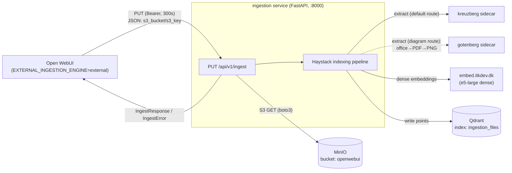
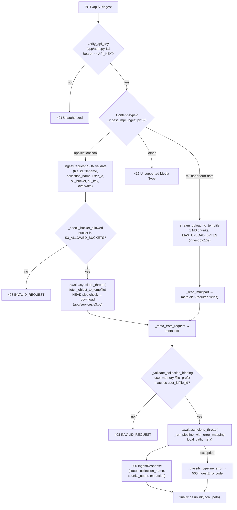
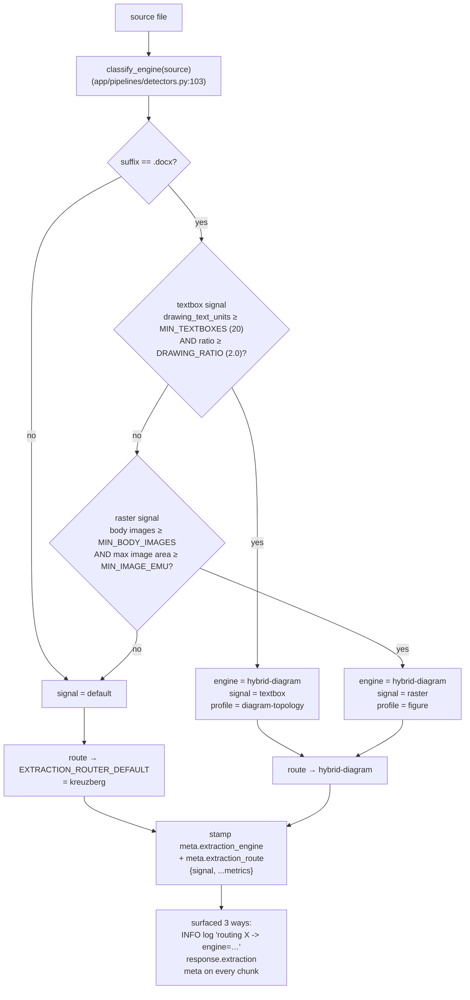
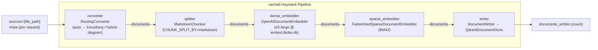

# Ingestion data flow (default configuration)

This document traces a document end-to-end through the ingestion service — from
Open WebUI's ingest call to the points written in Qdrant — **for the default
configuration as actually deployed by the parent stack**.

> **Why "as deployed" and not the standalone defaults?**
> The service's own `app/config.py` / `.env.example` carry one set of fallbacks,
> but the parent compose (`../docker-compose.yml`, the `ingestion:` service at
> lines 646–770) **overrides several of them**. The diagrams below depict the
> *effective* parent-stack values. If you run the service standalone, your
> defaults differ — see the table.

---

## 1. Effective default configuration

| Setting | Standalone (`app/config.py`) | **Effective (parent compose)** | Source |
|---|---|---|---|
| `EXTRACTION_ENGINE` | `kreuzberg` | **`auto`** | `../docker-compose.yml:681` |
| ↳ `EXTRACTION_ROUTER_DEFAULT` | `kreuzberg` | **`kreuzberg`** | `:687` |
| ↳ `EXTRACTION_ROUTER_DIAGRAM_ENGINE` | `hybrid-diagram` | **`hybrid-diagram`** | `:688` |
| ↳ `EXTRACTION_ROUTER_DIAGRAM_PROFILE` | `diagram` | **`diagram-topology`** | `:689` |
| `CHUNK_SPLIT_BY` | `token` | **`markdown`** | `:714` |
| `CHUNK_SIZE` / `CHUNK_OVERLAP` | `400` / `80` | `400` / `80` | `:712–713` |
| `CHUNK_MIN_SIZE` | `100` | `100` _(not set in compose → default)_ | `app/config.py` |
| `TOKENIZER_MODEL` / `TOKENIZER_REVISION` | _(empty → `EMBEDDING_MODEL`)_ / _(empty)_ | `intfloat/multilingual-e5-large` pinned to `3d7cfbd` | `:715–716` |
| `EMBEDDING_PROVIDER` | `openai-compat` | `openai-compat` @ `https://embed.itkdev.dk/v1` | `:721–722` |
| `EMBEDDING_MODEL` / `EMBEDDING_DIM` | `intfloat/multilingual-e5-large` / `1024` | same | `:724–725` |
| `EMBEDDING_PREFIX_DOC` | `passage: ` | `passage: ` | `:726` |
| `ENABLE_SPARSE_EMBEDDINGS` | **`false`** | **`true`** | `:734` |
| `SPARSE_EMBEDDING_MODEL` | `Qdrant/bm42-all-minilm-l6-v2-attentions` | same | `:736` |
| `QDRANT_URI` / `QDRANT_INDEX` | `http://qdrant:6333` / `ingestion_files` | same | `:738–740` |
| `S3_*` | MinIO | MinIO (`http://minio:9000`), allowlisted to bucket `openwebui` | `:742–748` |

**Net effect of the parent overrides:** the default pipeline runs **auto
routing** (kreuzberg for normal docs, hybrid-diagram for drawing-heavy `.docx`),
**markdown-aware chunking**, and **dense + sparse** embeddings — none of which
are the standalone code defaults.

Sidecars in play for the default flow:

| Sidecar | Role | Used by |
|---|---|---|
| **MinIO** | object storage; Open WebUI stores uploaded files here | S3 fetch (JSON mode) |
| **kreuzberg** | default text/structure extraction (HTTP sidecar) | router default route |
| **gotenberg** | office→PDF→PNG rendering for the vision pass | hybrid-diagram route |
| **embed.itkdev.dk** | OpenAI-compatible dense embeddings (e5-large) | dense embedder |
| **Qdrant** | vector store (dense + sparse named vectors) | writer |

---

## 2. System context (overview)



Open WebUI calls the service over the internal `app` network at
`http://ingestion:8000` (`EXTERNAL_INGESTION_URL`, parent `:99`), authenticated
with the shared `INGESTION_API_KEY`. The default integration uses **JSON mode**:
Open WebUI has already stored the upload in MinIO, so it sends an S3 *reference*
(`s3_bucket` / `s3_key`) rather than the file bytes.

---

## 3. Request lifecycle (entry layer)

Defined in `app/routes/ingest.py`. A single handler authenticates, dispatches on
`Content-Type`, lands the file on local disk, builds `meta`, then offloads the
blocking pipeline run to a worker thread.



**Threading model.** Both the blocking S3 fetch (boto3) and the synchronous
Haystack pipeline run are wrapped in `asyncio.to_thread(...)` so the event loop —
and the `/health` / `/health/ready` probes — stay responsive during a long
ingest. The tempfile is always removed in a `finally` block, on both success and
failure.

The `meta` dict that flows into the pipeline carries:
`file_id`, `filename`, `collection_name`, `collection_type`, `user_id`,
`overwrite`, `name`, `source`. `overwrite` is a control field — stripped before
`meta` reaches Qdrant.

---

## 4. Auto-routing detail (`EXTRACTION_ENGINE=auto`)

The cached pipeline has one fixed `"converter"` slot, so the per-document engine
decision lives *inside* a `RoutingConverter` (`app/pipelines/routing_converter.py`).
It builds one inner converter per routable engine at startup, then classifies and
delegates per source. Classification is `.docx`-only today; everything else takes
the default route.



Detection reads only `word/document.xml` (+ `docProps/app.xml` for the body-word
count), so it is zip-bomb safe and header/footer logos never trip the raster
signal. The raster gate has a third, opt-in condition not shown above:
`EXTRACTION_ROUTER_MIN_IMAGE_WORD_RATIO` (default `0` = off) additionally
requires `max_image_area / body_words` to clear a floor, guarding against a
lone large decorative photo in a prose-heavy doc. On any structural surprise
classification returns the **default** route — it never raises for routing
reasons.

> **Where the profile is really chosen.** `classify_engine()` emits only
> *engine + signal + metrics* (`RoutingDecision` has no profile field). The
> profile boxes above pair each signal with the profile it *yields*, but the
> router itself passes only `EXTRACTION_ROUTER_DIAGRAM_PROFILE` to the converter.
> `hybrid-diagram` ignores that on its main `.docx` path and re-inspects the file
> with `docx_diagram_profile()` — `diagram-topology` when labels are native text,
> `figure` when they're raster pixels (`app/pipelines/detectors.py:284`). The
> passed value only bites for hybrid's empty-docx fallback or a `vision-llm`
> diagram engine.

**The diagram route (`hybrid-diagram`)** pairs the two engine families by their
strengths (`app/pipelines/hybrid_diagram_converter.py`):

- **Native docx text** (`app/pipelines/docx_text.py`) is the authoritative body —
  every label pulled verbatim from the package XML.
- **The vision model supplies only the diagram.** Rendering goes office→PDF via
  the **Gotenberg** sidecar, then PDF→PNG locally, then a multimodal LLM
  reconstructs structure. Profile is `diagram-topology` (Mermaid graph, labels
  grounded in the native text) for a *vector* flowchart, or `figure` (read labels
  from pixels) for a flattened *raster* image.
- Non-`.docx` sources fall through to the plain vision path.

---

## 5. Haystack indexing pipeline

Built once at startup and cached (`app/pipelines/indexing.py:_build_pipeline`,
line 209). Every component is wrapped in `metrics.instrument_stage(...)` to record
`pipeline_stage_duration_seconds`. For the effective default (sparse **on**):



> When `ENABLE_SPARSE_EMBEDDINGS=false` (the standalone default), the
> `sparse_embedder` component is absent and `dense_embedder.documents` connects
> directly to `writer.documents`.

**Chunking — `MarkdownChunker` (`app/pipelines/splitter.py:95`).** Two stages
plus a merge pass:
1. Split on `#`/`##`/`###` headings (langchain `MarkdownHeaderTextSplitter`,
   `strip_headers=False`).
2. Merge pass: sections smaller than `CHUNK_MIN_SIZE` (100) tokens absorb the
   next section while they stay under the minimum and the combined size fits
   `CHUNK_SIZE`; a trailing tiny section folds backward into the previous
   chunk when it fits. A tiny section next to a huge one is emitted alone
   rather than creating something step 3 would re-split. Merged chunks carry
   the longest common prefix of their sections' heading paths as
   `headers` / `headers_breadcrumb` (empty prefix → no breadcrumb; each
   section's own heading line survives in the content). `0` disables.
3. Token-pack only the sections that exceed `CHUNK_SIZE` (400) using the
   e5-large tokenizer, with `CHUNK_OVERLAP` (80).

Each output chunk's `meta` inherits the request `meta` and gains:
- `headers` — outermost-first breadcrumb of the section heading hierarchy
  (`[]` outside any heading),
- `headers_breadcrumb` — the same path joined with `" > "` (e.g.
  `"Setup > Docker > Networking"`); omitted when there are no headings,
- `split_id` — monotonic chunk index across the whole document,
- `extraction_engine` / `extraction_route` — stamped by the router upstream.

**Embedding.** The dense embedder is a network call to the OpenAI-compatible
endpoint (`embed.itkdev.dk`), applying the `passage: ` document prefix. The sparse
embedder runs the BM42 model in-process via fastembed/ONNX, thread-capped
(`EMBEDDING_THREADS`, `parallel=1`) so it doesn't starve the event loop.

With `EMBED_HEADERS_BREADCRUMB=true` (default) all embedders pass
`meta_fields_to_embed=["headers_breadcrumb"]`, so the text they encode is
`passage: Setup > Docker > Networking\n<chunk content>` — the full section
path steers the vector (and BM42's keyword weights) while the stored
`content` stays clean; the retrieval agent hands stored content verbatim to
the answering LLM, so the breadcrumb never leaks into answer context. Chunks
without the field embed unchanged.

---

## 6. Qdrant write, idempotency & teardown

`run_indexing_pipeline(file_path, meta)` (`app/pipelines/indexing.py`) wraps
the pipeline run with a per-`file_id` lock and a **versioned (blue/green)
overwrite**: each run stamps a fresh `meta.ingest_version` onto its chunks
(changing their content+meta-hashed Haystack document IDs), so the new version
is written *alongside* the old points — the old version is only swept after
the new one fully landed, and a failed run tears down only its own points.

```mermaid
sequenceDiagram
    participant R as run_indexing_pipeline
    participant L as per-file_id lock
    participant Q as Qdrant
    participant P as Haystack pipeline

    R->>L: acquire (serialize same file_id)
    R->>R: _strip_control_fields(meta) drops overwrite,<br/>stamp meta.ingest_version = uuid4
    R->>P: pipeline.run with sources and meta,<br/>include_outputs_from converter
    alt success
        P-->>R: writer.documents_written
        alt overwrite is true (default) AND chunks > 0
            R->>Q: _delete_stale_versions(file_id, version)
            Note over Q: delete file_id points where<br/>ingest_version != this run's<br/>(also sweeps pre-versioning points)
        end
        Note over R: chunks == 0 → sweep skipped:<br/>empty extraction never replaces<br/>a good index (warning + metric)
        R->>R: _extraction_summary builds response.extraction
    else exception
        R->>Q: _delete_ingest_version(file_id, version) as teardown
        Note over Q: remove ONLY this run's points —<br/>the previous version stays live;<br/>collection-not-found is swallowed
        R->>R: re-raise, route maps to IngestError.code
    end
    R->>L: release
```

The old version stays searchable for the whole reindex — the only anomaly
window is the moment between write-complete and sweep, where a query can see
both versions (duplicates, not absence). If the sweep itself fails it is
swallowed with a WARNING; the next successful overwrite cleans up. Same for an
orphaned teardown: any leftover partial version matches the next sweep's
`ingest_version != current` filter.

**Vector store (`QdrantDocumentStore`, `indexing.py:180`).** Configured with
`embedding_dim=1024`, `use_sparse_embeddings=true`, and multitenancy HNSW
(`hnsw_config={"m": 0, "payload_m": 16}`). Each point carries **two named
vectors** — a dense vector (used by the per-tenant HNSW) and a sparse vector
(Qdrant's inverted index).

**Payload indexes (`app/services/qdrant_setup.py:ensure_payload_indexes`),
created at startup:**
- `meta.collection_name` — keyword index with `is_tenant=True`; the multitenancy
  key that gives each collection its own HNSW subgraph.
- `meta.collection_type` — keyword index for admin queries.
- `meta.languages` — keyword index on the list field (MatchAny-ready).
- `meta.file_id` — keyword index; every point op (versioned sweep/teardown,
  `DELETE /api/v1/documents/{file_id}`, chunk-inspection count/scroll) filters
  on it.
- `meta.ingest_version` — keyword index backing the blue/green overwrite's
  must/must_not filters.

---

## Appendix A — Qdrant point schema

Each written point's payload:

```python
{
    "content": "<chunk text>",
    "meta": {
        "file_id":         "<Open WebUI file UUID>",   # delete/idempotency key
        "collection_name": "<file-{uuid} | knowledge_id | user-memory-{uid} | ...>",  # tenant key
        "collection_type": "file | knowledge | memory | web-search | hash-based",
        "name":            "<filename>",
        "source":          "<filename>",
        "user_id":         "<user UUID>",
        "ingest_version":  "<uuid hex>",           # blue/green overwrite key, stamped per run
        "headers":         ["<h1>", "<h2>", ...],  # markdown chunking breadcrumb
        "headers_breadcrumb": "<h1> > <h2> > ...",  # joined form, embedded when EMBED_HEADERS_BREADCRUMB; omitted when no headings
        "split_id":        <int>,                  # chunk index within file
        # Auto-routing classification (EXTRACTION_ENGINE=auto):
        "extraction_engine": "kreuzberg | hybrid-diagram | ...",
        "extraction_route":  {"signal": "textbox|raster|default", ...metrics},
        # Optional document-level metadata (e.g. from kreuzberg): title, subject,
        # authors, created_at, languages — omitted when missing/empty.
    }
}
```

## Appendix B — Error-code map

The route layer maps pipeline exceptions to `IngestError.code`
(`app/routes/ingest.py:_classify_pipeline_error`, `app/models.py`):

| Failure | HTTP | `code` |
|---|---|---|
| Bad/missing Bearer token | 401 | _(not IngestError)_ |
| Validation / bad bucket / collection mismatch / bad content-type | 400 / 403 / 415 | `INVALID_REQUEST` |
| Upload or S3 object exceeds `MAX_UPLOAD_BYTES` | 413 | `INVALID_REQUEST` |
| S3 fetch (404 / auth / network) | 500 | `S3_FETCH_FAILED` |
| Extraction (kreuzberg/vision/etc.) | 500 | `EXTRACTION_FAILED` |
| Dense embedding | 500 | `EMBEDDING_FAILED` |
| Sparse embedding | 500 | `SPARSE_EMBEDDING_FAILED` |
| Qdrant write | 500 | `QDRANT_WRITE_FAILED` |
| Unclassified pipeline error | 500 | `PIPELINE_FAILED` |
| **Success** | 200 | _(IngestResponse)_ |

---

*Generated from a trace of the codebase. Diagrams reflect the effective default
configuration set by the parent stack's `docker-compose.yml`; re-verify the
config table against that file if the parent stack changes.*
