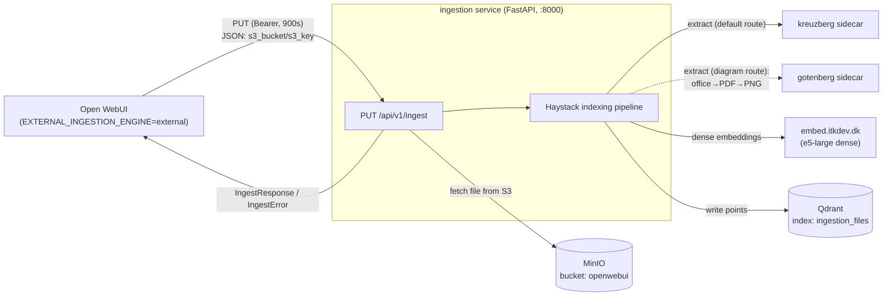
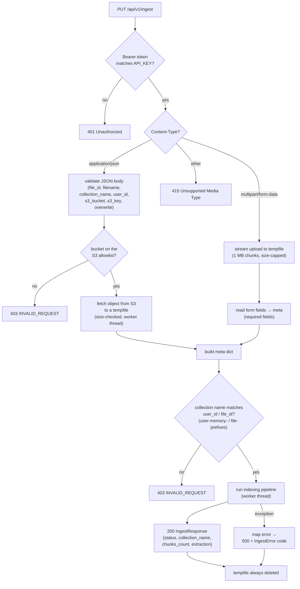
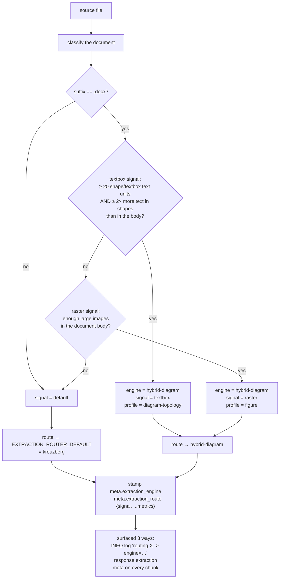
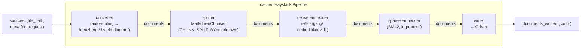
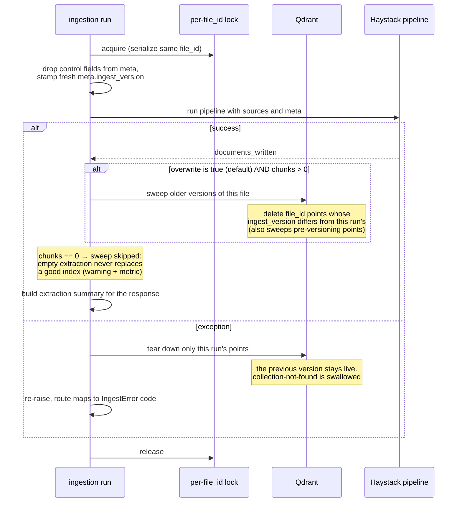

# Ingestion data flow (default configuration)

This document traces a document end-to-end through the ingestion service — from
Open WebUI's ingest call to the points written in Qdrant — **for the default
configuration as actually deployed by the parent stack**.

## 1. Effective default configuration

| Setting | Standalone default | **Effective (parent stack)** |
|---|---|---|
| `EXTRACTION_ENGINE` | `kreuzberg` | **`auto`** |
| ↳ `EXTRACTION_ROUTER_DEFAULT` | `kreuzberg` | **`kreuzberg`** |
| ↳ `EXTRACTION_ROUTER_DIAGRAM_ENGINE` | `hybrid-diagram` | **`hybrid-diagram`** |
| ↳ `EXTRACTION_ROUTER_DIAGRAM_PROFILE` | `diagram` | **`diagram-topology`** |
| `CHUNK_SPLIT_BY` | `token` | **`markdown`** |
| `CHUNK_SIZE` / `CHUNK_OVERLAP` | `400` / `80` | `400` / `80` |
| `CHUNK_MIN_SIZE` | `100` | `100` _(not set → default)_ |
| `TOKENIZER_MODEL` / `TOKENIZER_REVISION` | _(empty → `EMBEDDING_MODEL`)_ / _(empty)_ | `intfloat/multilingual-e5-large`, pinned revision |
| `EMBEDDING_PROVIDER` | `openai-compat` | `openai-compat` @ `https://embed.itkdev.dk/v1` |
| `EMBEDDING_MODEL` / `EMBEDDING_DIM` | `intfloat/multilingual-e5-large` / `1024` | same |
| `EMBEDDING_PREFIX_DOC` | `passage: ` | `passage: ` |
| `ENABLE_SPARSE_EMBEDDINGS` | **`false`** | **`true`** |
| `SPARSE_EMBEDDING_MODEL` | `Qdrant/bm42-all-minilm-l6-v2-attentions` | same |
| `QDRANT_URI` / `QDRANT_INDEX` | `http://qdrant:6333` / `ingestion_files` | same |
| `S3_*` | MinIO | MinIO (`http://minio:9000`), allowlisted to bucket `openwebui` |

The **Effective** column is what the parent stack's `docker-compose.yml` sets;
where it sets nothing, the service's own defaults apply.

Sidecars in play for the default flow:

| Sidecar | Role | Used by |
|---|---|---|
| **MinIO** | object storage; Open WebUI stores uploaded files here | S3 fetch (JSON mode) |
| **kreuzberg** | default text/structure extraction (HTTP sidecar) | router default route |
| **gotenberg** | office→PDF→PNG rendering for the vision pass | hybrid-diagram route |
| **embed.itkdev.dk** | OpenAI-compatible dense embeddings (e5-large) | dense embedder |
| **Qdrant** | vector store (dense + sparse named vectors) | writer |

---

## 2. System context (overview)



**Caller-budget contract.** The ingest PUT is fully synchronous — Open WebUI
blocks on it with a single `requests.put(timeout=EXTERNAL_INGESTION_TIMEOUT)`
(default **900s**, no retry) and marks the file `failed` if it expires. That
budget must exceed the sum of the service's slowest component read timeouts on the
vision/hybrid-diagram route — `GOTENBERG_READ_TIMEOUT` (120s) +
N×`VISION_LLM_READ_TIMEOUT` (180s per call) + embedding + Qdrant write — otherwise
the client gives up while the worker thread keeps running and, via the blue/green
overwrite, still commits a good version: the UI shows `failed` but Qdrant is
indexed. Raising the budget to 900s clears the realistic single-doc worst case; a
pathological multi-call document can still exceed it (the residual accepted for
this sync model — async ingest is the durable fix, tracked in `FINDINGS.md` #1).

## 3. Request lifecycle (entry layer)

A single handler authenticates, dispatches on `Content-Type`, lands the file on
local disk, builds `meta`, then offloads the blocking pipeline run to a worker
thread.



**Threading model.** Both the blocking S3 fetch and the synchronous Haystack
pipeline run happen in worker threads, so the event loop — and the `/health` /
`/health/ready` probes — stay responsive during a long ingest. The tempfile is
always removed, on both success and failure.

The `meta` dict that flows into the pipeline carries:
`file_id`, `filename`, `collection_name`, `collection_type`, `user_id`,
`overwrite`, `name`, `source`. `overwrite` is a control field — stripped before
`meta` reaches Qdrant.

---

## 4. Auto-routing detail (`EXTRACTION_ENGINE=auto`)

The cached pipeline has one fixed converter slot, so the per-document engine
decision lives *inside* a routing converter. It builds one inner converter per
routable engine at startup, then classifies and delegates per source.
Classification is `.docx`-only today; everything else takes the default route.



Detection reads only the document body (plus the document properties for the
body-word count), so it is zip-bomb safe and header/footer logos never trip the
raster signal. The thresholds are all tunable via the `EXTRACTION_ROUTER_*`
settings; the raster gate has a third, opt-in condition not shown above:
`EXTRACTION_ROUTER_MIN_IMAGE_WORD_RATIO` (default `0` = off) additionally
requires the image-area-to-word-count ratio to clear a floor, guarding against
a lone large decorative photo in a prose-heavy doc. On any structural surprise
classification returns the **default** route — it never raises for routing
reasons.

> **Where the profile is really chosen.** The router itself only decides
> *engine + signal* and passes along the configured
> `EXTRACTION_ROUTER_DIAGRAM_PROFILE`. The profile boxes above pair each signal
> with the profile it *yields* in practice, because `hybrid-diagram` ignores
> the passed value on its main `.docx` path and re-inspects the file itself:
> `diagram-topology` when the labels are native text, `figure` when they are
> raster pixels. The configured value only bites for hybrid's empty-docx
> fallback or when a plain `vision-llm` diagram engine is configured instead.

**The diagram route (`hybrid-diagram`)** pairs the two engine families by their
strengths:

- **Native docx text** is the authoritative body — every label pulled verbatim
  from the document package.
- **The vision model supplies only the diagram.** Rendering goes office→PDF via
  the **Gotenberg** sidecar, then PDF→PNG locally, then a multimodal LLM
  reconstructs structure. Profile is `diagram-topology` (Mermaid graph, labels
  grounded in the native text) for a *vector* flowchart, or `figure` (read labels
  from pixels) for a flattened *raster* image.
- Non-`.docx` sources fall through to the plain vision path.

---

## 5. Haystack indexing pipeline

Built once at startup and cached. Every stage is instrumented, so per-stage
latency shows up in the `pipeline_stage_duration_seconds` metric. For the
effective default (sparse **on**):



> When `ENABLE_SPARSE_EMBEDDINGS=false` (the standalone default), the sparse
> embedder is absent and the dense embedder feeds the writer directly.

**Chunking — the markdown chunker.** Two stages plus a merge pass:
1. Split on `#`/`##`/`###` headings (heading lines stay in the content).
2. Merge pass: sections smaller than `CHUNK_MIN_SIZE` (100) tokens absorb the
   next section while they stay under the minimum and the combined size fits
   `CHUNK_SIZE`; a trailing tiny section folds backward into the previous
   chunk when it fits. A tiny section next to a huge one is emitted alone
   rather than creating something step 3 would re-split. Merged chunks carry
   the longest common prefix of their sections' heading paths as
   `headers` / `headers_breadcrumb` (empty prefix → no breadcrumb; each
   section's own heading line survives in the content). `0` disables.
3. Token-pack only the sections that exceed `CHUNK_SIZE` (400) using the
   e5-large tokenizer, with `CHUNK_OVERLAP` (80).

Each output chunk's `meta` inherits the request `meta` and gains:
- `headers` — outermost-first breadcrumb of the section heading hierarchy
  (`[]` outside any heading),
- `headers_breadcrumb` — the same path joined with `" > "` (e.g.
  `"Setup > Docker > Networking"`); omitted when there are no headings,
- `split_id` — monotonic chunk index across the whole document,
- `extraction_engine` / `extraction_route` — stamped by the router upstream.

**Embedding.** The dense embedder is a network call to the OpenAI-compatible
endpoint (`embed.itkdev.dk`), applying the `passage: ` document prefix. The sparse
embedder runs the BM42 model in-process, thread-capped (`EMBEDDING_THREADS`)
so it doesn't starve the event loop.

With `EMBED_HEADERS_BREADCRUMB=true` (default) both embedders prepend the
breadcrumb to the text they encode, so the vector sees
`passage: Setup > Docker > Networking\n<chunk content>` — the full section
path steers the vector (and BM42's keyword weights) while the stored
`content` stays clean; the retrieval agent hands stored content verbatim to
the answering LLM, so the breadcrumb never leaks into answer context. Chunks
without a breadcrumb embed unchanged.

---

## 6. Qdrant write, idempotency & teardown

The ingestion run wraps the pipeline with a per-`file_id` lock and a
**versioned (blue/green) overwrite**: each run stamps a fresh
`meta.ingest_version` onto its chunks (which also changes their content-hashed
document IDs), so the new version is written *alongside* the old points — the
old version is only swept after the new one fully landed, and a failed run
tears down only its own points.



The old version stays searchable for the whole reindex — the only anomaly
window is the moment between write-complete and sweep, where a query can see
both versions (duplicates, not absence). If the sweep itself fails it is
swallowed with a WARNING; the next successful overwrite cleans up. Same for an
orphaned teardown: any leftover partial version matches the next sweep's
"different `ingest_version`" filter.

**Vector store.** The Qdrant collection is configured with
`embedding_dim=1024`, sparse embeddings enabled, and multitenancy HNSW
(no global graph, per-tenant subgraphs). Each point carries **two named
vectors** — a dense vector (used by the per-tenant HNSW) and a sparse vector
(Qdrant's inverted index).

**Payload indexes, created at startup:**
- `meta.collection_name` — keyword index marked as the tenant key; gives each
  collection its own HNSW subgraph.
- `meta.collection_type` — keyword index for admin queries.
- `meta.languages` — keyword index on the list field (MatchAny-ready).
- `meta.file_id` — keyword index; every point op (versioned sweep/teardown,
  `DELETE /api/v1/documents/{file_id}`, chunk-inspection count/scroll) filters
  on it.
- `meta.ingest_version` — keyword index backing the blue/green overwrite's
  filters.

---

## Appendix A — Qdrant point schema

Each written point's payload:

```python
{
    "content": "<chunk text>",
    "meta": {
        "file_id":         "<Open WebUI file UUID>",   # delete/idempotency key
        "collection_name": "<file-{uuid} | knowledge_id | user-memory-{uid} | ...>",  # tenant key
        "collection_type": "file | knowledge | memory | web-search | hash-based",
        "name":            "<filename>",
        "source":          "<filename>",
        "user_id":         "<user UUID>",
        "ingest_version":  "<uuid hex>",           # blue/green overwrite key, stamped per run
        "headers":         ["<h1>", "<h2>", ...],  # markdown chunking breadcrumb
        "headers_breadcrumb": "<h1> > <h2> > ...",  # joined form, embedded when EMBED_HEADERS_BREADCRUMB; omitted when no headings
        "split_id":        <int>,                  # chunk index within file
        # Auto-routing classification (EXTRACTION_ENGINE=auto):
        "extraction_engine": "kreuzberg | hybrid-diagram | ...",
        "extraction_route":  {"signal": "textbox|raster|default", ...metrics},
        # Optional document-level metadata (e.g. from kreuzberg): title, subject,
        # authors, created_at, languages — omitted when missing/empty.
    }
}
```

## Appendix B — Error-code map

The route layer maps pipeline exceptions to an `IngestError` code:

| Failure | HTTP | `code` |
|---|---|---|
| Bad/missing Bearer token | 401 | _(not IngestError)_ |
| Validation / bad bucket / collection mismatch / bad content-type | 400 / 403 / 415 | `INVALID_REQUEST` |
| Upload or S3 object exceeds `MAX_UPLOAD_BYTES` | 413 | `INVALID_REQUEST` |
| S3 fetch (404 / auth / network) | 500 | `S3_FETCH_FAILED` |
| Extraction (kreuzberg/vision/etc.) | 500 | `EXTRACTION_FAILED` |
| Dense embedding | 500 | `EMBEDDING_FAILED` |
| Sparse embedding | 500 | `SPARSE_EMBEDDING_FAILED` |
| Qdrant write | 500 | `QDRANT_WRITE_FAILED` |
| Unclassified pipeline error | 500 | `PIPELINE_FAILED` |
| **Success** | 200 | _(IngestResponse)_ |

---

*Diagrams reflect the effective default configuration set by the parent
stack's `docker-compose.yml`; re-verify the config table against that file if
the parent stack changes.*
